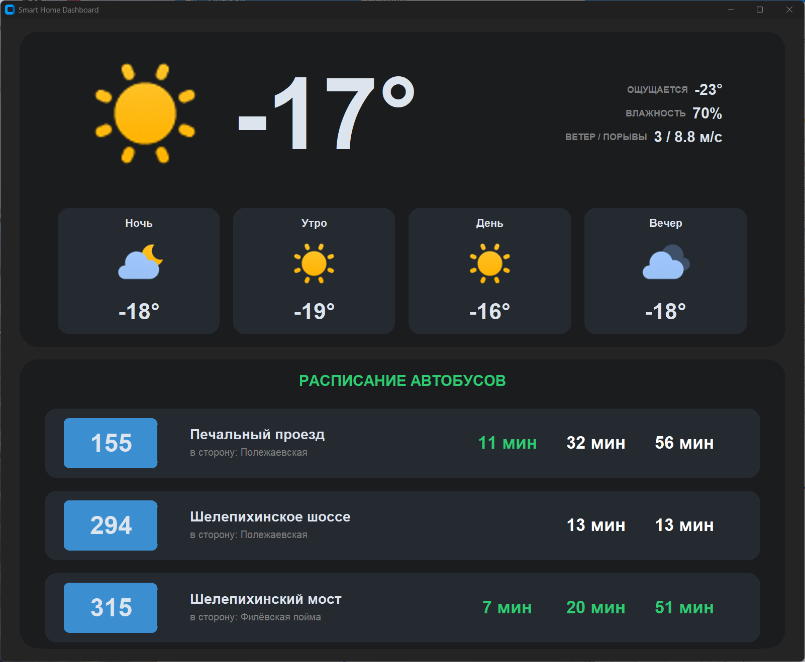

# Проект домашнего табло

Прочел как-то в интернете заметку про доброго человека, который сделал дома табло с актуальным расписанием времени до прихода автобуса (как на остановках в Москве). Идея понравилась и я ее благополучно забыл. А потом вспомнил.

Итак, необходимо:
1. Сервер (мне кажется, подойдет Raspberry 3 и мощнее), лишь бы работал Python
2. Монитор (куплен на Авито за 300р в соседнем доме)
3. ПО

Собственно, ПО в файле main.py.

Особенности:
1. Написано роботом с небольшими доработками (Geminy, бесплатный)
2. Размер экрана 1280х1080
3. Python 3.12 (кажется, в общем тот, что по умолчанию в Ubuntu 24). Кажется, это не принципиально, лишь бы был пакет customtkinter
4. Чувствительные данные (APIKey Яндекс Погода, координаты) необходимо добавить в отдельный файл mysecretkeys.py в формате 

        YAweather_key = "XXXX-XXXX-XXXX-XXXX-...."

        YAlat = 50.XXXXX

        YAlon = 30.XXXXX
        
5. Приниципы работы с API Московский Транспорт я взял вот тут [https://github.com/egmen/moscow_transport](https://github.com/egmen/moscow_transport). Оно недокументируемое, гарантий никаких нет. И да, работает только в Москве
6. Зеленые данные о времени - это там, где поле telemetry = 1. Предполагаю, что это гласит о том, что есть данные непосредственно с автобуса, а не только из расписания. Но гарантии нет

## Результат

